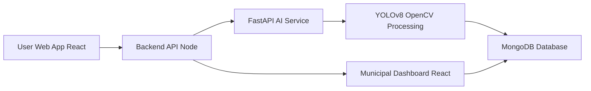
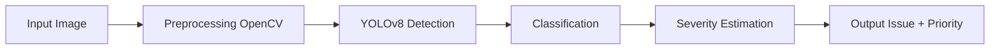
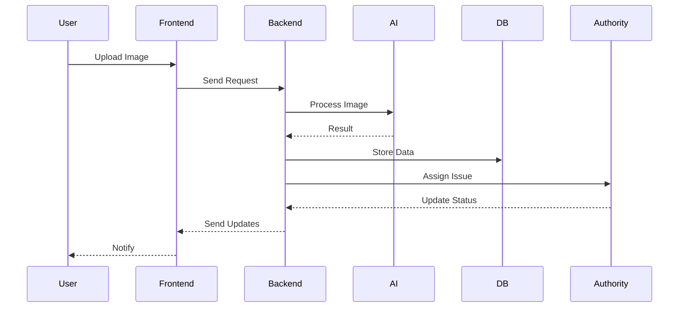

# 🚀 CivicLens – AI-Powered Civic Issue Detection & Routing System

CivicLens is a smart civic issue management platform designed to transform how urban problems are reported and resolved. By combining Computer Vision, automation, and intelligent decision-making, it enables faster, more efficient, and data-driven governance.

---

## 🌍 Problem Statement

Urban civic issues such as potholes, garbage accumulation, and water leakage often remain unresolved due to:

* Manual and unstructured reporting systems
* Lack of prioritization of critical issues
* Inefficient routing and delayed response

These challenges lead to poor infrastructure management, slower resolution times, and reduced citizen trust.

---

## 💡 Proposed Solution

CivicLens introduces an AI-powered system that:

* Detects civic issues directly from images
* Automatically assigns priority based on real-world factors
* Routes complaints to the correct department without manual intervention
* Provides a real-time dashboard for monitoring and resolution

The goal is to move from **complaint collection → intelligent resolution**.

---

## 🧠 Core Features

* 📸 **AI-Based Issue Detection**
* ⚡ **Smart Priority Engine**
* 🔄 **Automated Routing System**
* 🗺️ **Live Monitoring Dashboard**
* 🔔 **Status Tracking**
* 🧠 **Duplicate Detection**

---

## 🏗️ System Architecture

---

## 🔄 System Workflow

---

## 🧠 AI Processing Pipeline

---

## 📊 Data Flow Diagram

---

## 🧰 Technology Stack

### Frontend

* React.js
* Vercel

### Backend

* Node.js
* FastAPI
* Render

### AI / ML

* YOLOv8
* OpenCV

### Database

* MongoDB

### DevOps

* Docker

---

## ⚙️ System Intelligence

* Real-time processing
* Location-aware prioritization
* AI-driven decisions
* Scalable architecture

---

## 📈 Feasibility

* Uses pre-trained models
* Lightweight tech stack
* Easy to scale
* Hackathon-ready

---

## 📈 Impact

* 🏙️ Smarter city management
* ⚡ Faster issue resolution
* 📊 Data-driven governance
* 🤝 Better transparency
* ⚙️ Efficient resource use

---

## 🌱 SDG Alignment

Aligned with **UN SDG 11: Sustainable Cities and Communities**

---

## 🔮 Future Scope

* WhatsApp integration
* Voice-based reporting
* Predictive analytics
* Smart city integration

---

## 👨‍💻 Team

* Rishabh Dev Pandey
* Raghav Rege
* Devansh Saxena
* Swarnava Sarkar

---

## 📌 Note

This project is currently in the design phase.
