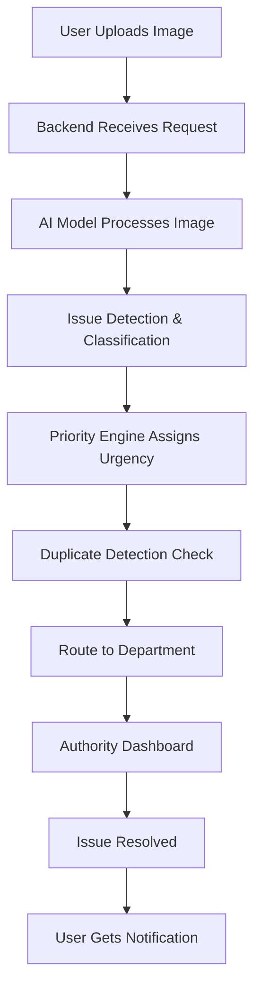
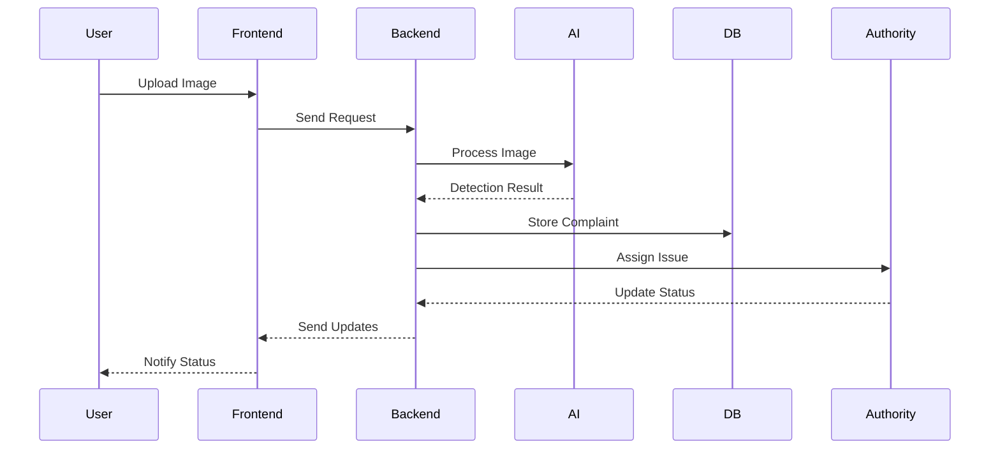

# 🚀 CivicLens – AI-Powered Civic Issue Detection & Routing System

CivicLens is a smart civic issue management platform designed to transform how urban problems are reported and resolved. By combining Computer Vision, automation, and intelligent decision-making, it enables faster, more efficient, and data-driven governance.

---

## 🌍 Problem Statement

Urban civic issues such as potholes, garbage accumulation, and water leakage often remain unresolved due to:

* Manual and unstructured reporting systems
* Lack of prioritization of critical issues
* Inefficient routing and delayed response

These challenges lead to poor infrastructure management, slower resolution times, and reduced citizen trust.

---

## 💡 Proposed Solution

CivicLens introduces an AI-powered system that:

* Detects civic issues directly from images
* Automatically assigns priority based on real-world factors
* Routes complaints to the correct department without manual intervention
* Provides a real-time dashboard for monitoring and resolution

The goal is to move from **complaint collection → intelligent resolution**.

---

## 🧠 Core Features

* 📸 **AI-Based Issue Detection**
  Uses computer vision to identify civic problems from images

* ⚡ **Smart Priority Engine**
  Assigns urgency based on severity, location, and crowd density

* 🔄 **Automated Routing System**
  Directs complaints to the appropriate department

* 🗺️ **Live Monitoring Dashboard**
  Displays complaints and their status in real-time

* 🔔 **Status Tracking**
  Keeps users informed throughout the resolution process

* 🧠 **Duplicate Detection**
  Prevents redundant complaints using location and image similarity

---

## 🏗️ System Architecture

```mermaid
graph TD
    A[User - Web/App (React)] --> B[Backend API (Node.js)]
    B --> C[FastAPI AI Service]
    C --> D[YOLOv8 + OpenCV Processing]
    D --> E[MongoDB Database]
    B --> F[Municipal Dashboard (React)]
    F --> E
```

---

## 🔄 System Workflow



---

## 🧠 AI Processing Pipeline

```mermaid
flowchart LR
    A[Input Image] --> B[Preprocessing (OpenCV)]
    B --> C[YOLOv8 Detection]
    C --> D[Object Classification]
    D --> E[Severity Estimation]
    E --> F[Output: Issue Type + Priority]
```

---

## 📊 Data Flow Diagram



---

## 🧰 Technology Stack

### Frontend

* React.js (User Interface & Dashboard)
* Vercel (Deployment)

### Backend

* Node.js (API Layer)
* Python FastAPI (AI Services)
* Render (Deployment)

### AI / ML

* YOLOv8 (Object Detection)
* OpenCV (Image Processing)

### Database

* MongoDB

### DevOps

* Docker (Containerization)

---

## ⚙️ System Intelligence

* Real-time complaint processing
* Location-aware prioritization
* AI-driven decision-making
* Scalable and modular architecture

---

## 📈 Feasibility

* Uses pre-trained AI models for faster development
* Built on lightweight, widely-used technologies
* Modular design enables easy scalability
* Suitable for rapid prototyping in hackathon environments

---

## 📈 Impact

* 🏙️ Enables smarter city management
* ⚡ Reduces issue resolution time
* 📊 Supports data-driven governance
* 🤝 Improves transparency and accountability
* ⚙️ Optimizes resource allocation

---

## 🌱 SDG Alignment

CivicLens aligns with **UN Sustainable Development Goal 11: Sustainable Cities and Communities** by improving urban infrastructure management, enhancing public service efficiency, and promoting citizen participation.

---

## 🔮 Future Scope

* WhatsApp and voice-based complaint system
* Predictive analytics for urban planning
* Integration with smart city ecosystems
* Real-time alerts for high-priority issues

---

## 👨‍💻 Team

* Your Name
* Team Member 2
* Team Member 3
* Team Member 4

---

## 📌 Note

This project is currently in the design and planning phase, focusing on system architecture, AI integration, and scalable implementation strategy.
